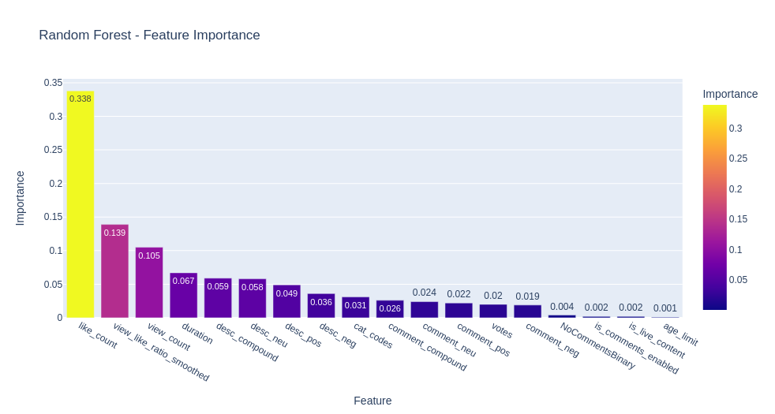

# youtube-dislikes
University of Michigan - MADS - Capstone Project - Analysis and Prediction of dislikes on Youtube data

# Team Members
- James Mete (jmete)
- Jenna Mekled (jmekled)
- Sashaank Sekar (sashaank)

# Introduction
Dislike counts on Youtube videos are a useful signal for separating high quality videos from low quality videos or even potential scams. Youtube has recently removed the ability to see dislike count data publicly, and have disabled dislike count data in their API. Thus, our project seeks to understand the trends that influence dislike activity through analytical research and use those insights to generate a machine learning model to predict dislike counts or ratios to help alert users to potentially problematic videos based on the available data and features.

# Dataset
Since Youtube has removed the ability to actively scrape or query dislike counts, we have to rely on historical data to conduct our research. Luckily, extensive historical records have been kept by Archive.org, and we will use one called “Youtube Metadata Collection (2019-02)” (https://archive.org/details/Youtube_metadata_02_2019) which consists of around 1.46 Billion JSON records related to youtube metadata such as title, upload date, category, likes, dislikes, language, recommended videos, and other features. This is composed of around 5000 .tar files each with around 146 .json.gz files inside them which will require extensive data processing to download the files, process them, and store the data for future analysis. 

Our processing techniques will involve taking a sample of the full dataset (we downloaded the first 25 files and then every fifth file afterwards for a total of 1025 .tar files) as well as removing potential NaN / Errors in calculated fields such as the like_dislike_ratio. The end result is a dataset of **80,910,144 rows**. We can conduct large-scale analysis using SQL commands over the full dataset.

We will complement this dataset with scraped comments of top videos (based on view count) to both add an element of NLP analysis which may also be a useful signal towards predicting whether or not a video may have a high number of dislikes.

Finally, we will be exporting smaller CSVs that are more useful for deeper analysis such as:
- Exporting the top 500,000 most disliked rows based on dislike_like_ratio
- Exporting the top 500,000 most liked rows based on dislike_like ratio
- Exporting a 1% random sample resulting in over 800,000 rows.
- Exporting a 0.2% random sample used for testing purposes.

# TLDR:

## What is provided?
We provide the following:
- A pre-trained Random Forest model that can be used to classify youtube videos.
- A pipeline that can download and process data, train the model, and export it.
- A web app to easily use the model.
- We also have a blog where we discuss our findings in more detail and provide visualizations.1

Note: If you don't want to run the pipeline. You can use either the web app, or download the provided rf_clf.joblib.pkl classifier model and skip to the inference section below.

## Quick Model Metrics
Random Forest was our best model that displayed good performance while still being fairly balanced across multiple classes, although we do notice a sharp decrease in performance for neutral videos.

**On our test set we scored**:
- Accuracy score of 82%
- F1 Weighted score of 80%
- MCC score of 0.56

## Performance Disclaimer
This model was trained on english videos ONLY. Due to our imbalanced dataset (“good” videos are more prevalent than “bad” or “neutral” videos), we focused on various F1 scores, Accuracy, and MCC (Matthews correlation coefficient) to track model performance.

While we do believe our model will still perform fairly well due to the impact of other features, we can’t guarantee any accuracy metrics on non-english videos, especially due to current limitations in the sentiment analysis library used. We recognize these elements may introduce bias into the model, and hopefully can improve it in the future!

## How Do I Run The Pipeline?
 **We have developed a shell script to run our pipeline to download data, process it, and export a trained machine learning model that can be used to classify videos as negative, neutral, or positive**. The steps are as follows:
1. Make sure you are in a linux / unix environment with a bash terminal. (Specifically Debian based distros)
2. Install Miniconda: https://docs.conda.io/projects/conda/en/latest/user-guide/install/index.html
3. Setup a postgres database.
4. Fill out the config.yml file as directed. This is mainly used to locate your storage location of large files, and database parameters.
5. You may need to edit the ./runpipeline.sh file to make it executable. (chmod +x runpipeline.sh)
6. Run ./runpipeline.sh and follow the prompts.

Congratulations, you will end up with a trained Random Forest model that can be used to predict youtube videos (based on the relevant data we will mention below) as either negative (-1), neutral (0), or positive (1). It should be noted that this score is NOT referring to sentiment of the video itself, but rather perception of the video in the eyes of the community based on likes and dislikes, the latter of which we can no longer publically view.

## Using the model at inference time.
Our model is a Random Forest model that was trained on youtube api data including comments, and expects the input data in a dataframe. For some elements of this, you may need access to the Youtube API. The steps for inference are:
1. Download youtube api data with required columns which are
- duration
- age_limit
- view_count
- like_count
- is_comments_enabled
- is_live_content
- cat_codes (category code number)
2. Download comment data as df. You can use our web scraper script using a csv file with just 1 row and load as a dataframe, or use the youtube API directly.
3. If no comments were available, make note of that in the "NoCommentsBinary" Column. 1 = No Comments.
4. Use the create_final_dataframe() function in the data_prep_for_pred.py file that takes in the comment_df and video_data_df and will output a processed dataframe that can be used for inference. It will add a few more columns such as a smoothed view_like_ratio and sentiment analysis columns.
5. Use the make_pred() function in the predict_model.py file to take in the processed inference dataframe and the path to the classifier (by default in the models folder) and it will output the class as a number. Note: Sometimes pandas will format a "1-row" dataframe as a series which will cause issues. You can use .to_frame().T on the series to convert it to a 1-row dataframe suitable for the model.
6. -1 = Negative, 0 = Neutral, 1 = Positive

## Using our web app
We have developed a web app which does all of the above steps for you which makes it easy to use.
1. Go to savethedislikes.com
2. Input your video URL and click the button
3. Enjoy the returned prediction and relevant data about the video!

# Setup

## Our Machine
While we are performing experimentation and development on personal machines, our main production environment for running the full analysis code is the following:
- Linux (Pop!_OS 21.10, Based on Ubuntu)
- 64-bit operating system
- 73.1 GB RAM
- 6 Cores / 12 Threads
- Nvidia GeForce 3060 12GB VRAM
- PostgreSQL V14.2 (Debian 14.2-1.pgdg110+1) Installed via host machine

This is running as a KVM virtual machine inside a host server with the following specs:
- Intel Core i9-7940X CPU @ 3.10 GHz
- 128 GB RAM
- Linux (Unraid)

## Setting up your environment
We have used conda as an environment manager starting with the **rapids-ai template environment** (https://rapids.ai/start.html) which allows us access to gpu enabled processing libraries such as cuDF. We then add on to that environment with other needed packages as detailed in the **requirements.txt** file.

### Important packages & libraries include:
- Rapids AI suite (cuDF)
- Pandas
- Numpy
- SQLAlchemy
- PSYCOPG2
- Glob
- OS
- Plotly

## Setting up the database
PostgreSQL V14.2.
### Installing postgresql
In our case, this was installed through our host OS (unraid) which has a useful docker interface. However, any postgres environment will be suitable. Installing postgressql can differ depending on your environment, but a helpful tutorial is located here: https://www.postgresql.org/docs/14/tutorial-install.html

Furthermore, download options can be found here: https://www.postgresql.org/download/

For Ubuntu specifically:
https://www.postgresql.org/download/linux/ubuntu/

### Logging into the database

All mentioned database related scripts and commands in this section were run by logging into the database through psql which you can install on your local machine and connect remotely to the database. More information can be found here: https://www.postgresql.org/docs/14/app-psql.html

### Setting up the database and table

We set up our initial database through a UI installed through our host machine called "Adminer" (version 4.8.1). However, we have provided a SQL script to create the database as well in "create_database.sql". This will create a database called "youtube-dislikes".

Next, we create the table that will store our video data. Running the "create_video_table.sql" command through psql will drop the table if it already exists, then creates it as a fresh table with the appropirate schema.

## Setting up the config.yml file
Inside our repo is a config.yml-example file. This file is meant to be edited with various variables relevant to your system such as the storage path of where to save / load the dataset from, as well as security passwords which need to be kept safe. 

After editing the file as detailed inside the template, you should rename it to "config.yml" which will allow it to be accessed by future scripts in the project.

# Processing Steps

NOTE: If you are interested in running these scripts, we HIGHLY suggest you skip the data download and processing steps due to the massive size, hardware requirements, and overall long processing times! Utilizing processed data such as the provided .csv files is preferred for analysis purposes.

## Downloading the dataset
As mentioned previously, we will use a historical dataset called “Youtube Metadata Collection (2019-02)” which is located at https://archive.org/details/Youtube_metadata_02_2019

Running the **downloadtars.py** file allows the users to incrementally download the .tar files from archive.org. The script monitors the storagepath folder to check for downloaded files and skips them if detected. This helps if the script fails during procsesing and needs to be restarted.

We highly suggest using a NAS (network attached storage) for this since the massive dataset can be hundreds of GB in size. 

## Processing JSON
Running **combinejson.py** will go to the storagepath location, and process json files in batches by loading a user-specificed amount (which should be set depending on your memory capacity) into Pandas, and then exports the data into parquet files in a parq folder inside the storagepath location.

Doing so allows us to reduce over 140,000 JSON files into 301 Parquet files (each ~1,000,000 rows of data). While this adds an extremely lengthy processing step instead of directly going from JSON -> PostgreSQL, we found that pre-processing into parquet files can help with initial analysis and reduce IO bottlenecks later on when loading data into PostgreSQL.

**Note:** combinejson.py will create .pickle files it will use to store which paths it has already processed which will enable it to skip already processed files which helps if it ever gets stopped before completion.

## Loading data into PostgreSQL

Running **dataentry_from_parquet.py** will loop through the stored parquet files based on the storagepath variable (where combinejson.py saved them), performs some initial data cleaning and processing, arranges and renames the columns in the same order/name as the PostgreSQL table schema expects, and then loads the data into the database table.

Data processing steps performed at this step include:
- Converting date columns to datetime format.
- Converting dicts to json string objects that is suitable to be imported into PostgreSQL for a JSONB formatted column.
- Calculates initial ratios including view_like_ratio, view_dislike_ratio, and like_dislike_ratio
- Drops INF and NaN rows for the like_dislike_ratio to reduce dataset size and potential errors later on. We mainly only care about videos that actually have dislikes.
- Rename and Reorder columns to match database table schema.
- Loads data into PostgreSQL using batch importing utilizing the pd.to_sql command with multi mode enabled and a chunksize of 10,000 as default.

**Note:** dataentry_from_parquet.py will create .pickle files it will use to store which paths it has already processed which will enable it to skip already processed files which helps if it ever gets stopped before completion.

**Note:** After initial investigation, we decided to go with dislike_like_ratio, although this is not present in the script. This is because it is included as a calcualated column in PostgreSQL itself. Furthermore, we used a normalization technique of adding 1 to the numerator and denominator to avoid any 0 division errors as well as avoiding too many rows simply being 0 (due to 0/X = 0). This column is a major focal point of our research since it allows us to sort the database by the dislike_like_ratio as well as determine roughly how problematic a video is. However, we will not be able to calculate this in a real-life situation due to the dislike data being hidden which is a future challenge. Thus, we must find suitable proxies during our analysis stage.

## Optimizing the database
We entered multiple commands through psql to optimize the database. We performed the "ANALYZE" command on the table, as well as created an index for important columns used for lookups or sorting which are view_count,like_count,dislike_count, and dislike_like_ratio. Please see the related "optimizedb.sql" file for details on the commands entered.

Performing such optimizations allowed us to shorten processing times from over 8 hours to a few minutes or even seconds depending on the complexity of the sql command.

## Extracting csv files for analysis
Once our data is inside PostgreSQL, we can use sql commands to run operations to extract a smaller sample size better suited for statistical analysis. The csv files we extracted were the following:
- Exporting the top 500,000 most disliked rows based on dislike_like_ratio.
- Exporting the top 500,000 most liked rows based on dislike_like ratio.
- Exporting a 1% random sample resulting in over 800,000 rows.
- Exporting a 10% random sample. This will be used for testing if a lot more data improves predictive performance.
- Exporting a 0.2% random sample used for final testing.

Please see the related "psql_export_csv.sql" file for details on the commands entered.
The files exported would be used for analysis and model training/testing purposes.

## Downloading comment data
In order to gain further insight and acquire more data for our model to use, we decided to download the top 10 comments of each video in our exported CSVs that includes information such as:
- Number of votes
- Text Content
- Hearts (only can be given by the video owner)

We modified a package on github (cdownload_noargs.py: https://github.com/egbertbouman/youtube-comment-downloader) in order to aid our web scraping of comments, and then made our own python file to integrate with the modified function in order to automatically loop through the videos, download the comments and related data, and store them in both individual JSON files as well as overall CSV files.

Running the **download_main_args_inputfile.py** function can take in the related name of the exported CSV file (such as the random 1% sample), the starting point, and a parameter for whether it should convert the CSV file id column to a list that it can loop through. Example of running it may be:
python src/data/download_main_args_inputfile.py 0 n nameofcsvfile

By default, it will look in the data/processed folder to find the csv files. It will save the comments to data/processed/comments_csv/filename/

Note: We explored using both a custom web scraper as well as the youtube API.

# Analysis & Feature Engineering

## Initial Analysis
With our exported CSV files, we performed multiple initial analysis steps to help uncover any insights regarding the data.
One of our main goals was to discover if any features were correlated or useful in relation to predicting dislikes, or at least the dislike ratio category based on a set criteria of our research in regards to what youtubers consider a “good” or “bad” video to be in relation to their like to dislike ratio.

Analysis we performed included:
- PCA Analysis
- Feature Correlation Analysis
- Statistical Analysis on the full database dataset as well as our subset exported into CSVs
- Comparing the extremes of most liked and most disliked videos across multiple features

## Feature Engineering
Our initial analysis led us to ideas of feature engineering that we could calculate based on the available data. 

Features we created to assist our analysis and model building include:
- Sentiment Analysis features (negative,neutral,positive,compound) for comment text and description text. We used NLTK Vader as our sentiment analyzer. It seemed to have better performance than other libraries such as textblob and fasttext.
- LD Score: Likes / (Likes + Dislikes)
- LD Score OHE: Converting decimal LD Score to categorical -1 (negative), 0 (neutral), and 1 (positive).
- View_Like Ratio: view_count / like_count
- View_Like Ratio Smoothed: If like_count is 0, we add 1 to view_count and like_count to avoid division by 0.
- View_Dislike Ratio: view_count / dislike_count
- Dislike-Like Ratio: dislike_count / like_count (smoothed by 1 to avoid division by 0)
- NoCommentsBinary: 0 if the video had comments, and 1 if the video did not have comments when we attempted to pull the data.

Although we can not use any of the features involving dislike count at inference time, we used them in our analysis to better understand the data as well as filter our main dataset to extract useful rows such as the most disliked or liked video rows based on dislike_like_ratio. We believed these extremes combined with the random 1% would allow for a diverse set of video information for our machine learning models to learn from.

## Preparing Data For Machine Learning
We developed a pipeline to properly format our data as suitable dataframes for our machine learning models. Steps include:
- Reading CSV files into DataFrames.
- Combining our most liked, most disliked, and random 1% dataframes into one major training dataframe using pd.concat.
- Shuffling the training dataframe.
- Clean text columns such as description and comment text using various regex functions.
- Performing sentiment analysis and creating relevant columns based on that.
- Removing non-english videos of training data (we observed no lack of model predictive performance by doing so and it allows for better sentiment analysis)
- Grouping comments by video_id and taking the mean. This will give average sentiment and votes per video_id.
- Merging processed comments df with processed archive df based on video_id
- Adding the NoCommentsBinary file based on the result of the data scraping.
- Replacing NaN values with 0 (this is done first in the archive data and again after merging with comments)
- Returning final clean dataframe

Running data_prep_for_model.py will perform this pipeline automatically by taking the relevant CSV files from the data/processed folder and outputting training_df and testing_df pickled dataframes.

Note: At inference time, we perform a similar function to prepare the data that we pull from the API + Comments, but slightly modified to account for which data is available and the way we can get the data since it will only need to input one video at a time instead of a batch of existing data.

# Machine Learning Model Training & Testing
We explored numerous types of models to determine which model had the best performance for our task. It should be noted that our task in this case is not actually to get the overall best performance on the entire dataset, but rather a specific focus on identifying negative videos. Thus, we relied on numerous metrics to help give a holistic view of the models performance. **We ultimately decided on Random Forest as the best overall choice.**

## Performance Metrics Used

Due to our imbalanced dataset (positive videos are much more numerous than negative or neutral videos), we focused on various F1 scores, Accuracy, and MCC (Matthews correlation coefficient) to track model performance.

Furthermore, we checked the confusion matrix of each model to better understand which classes / labels our models were performing well on, and which they were performing poor on.

## Optimizing Our Models
In order to optimize our model we tried the following tactics:
- GridSearch over various parameters
- Scaling our training data via StandardScaler()
- Manual tuning of parameters
- Checking for feature importance and impact on predictive performance
- Checking dataset size and impact on predictive performance

## Models Tested
The models we tested were the following:

### Dummy Classifier:
To get a baseline of performance.
### Logistic Regression: 
It performed better than the Dummy but wasn't ideal. However, we did not really attempt to tune it.
### Gradient Boosting Machines: 
Performed quite well on the overall testing dataset but sacrificed negative video accuracy in favor of positive video accuracy which is not ideal for our specific task.
### Random Forest:
Performed the best overall with minimal tuning, and was not impacted by standardization. The Random Forest was quick to train, performed well even with default settings, and was very interpretable due to the easy visualization capabilities of feature importance.
### Multi-Layer Perceptron:
Decent performance but took a long time to train using sklearn. We also tried a GPU accelerated tabular learner through fast.ai but both didn't have the best performance compared to the Random Forest. Each of them seemed to completely ignore the neutral videos.
### Transformer Network: 
Deep learning has become a pillar of the modern world, especially with the rise of larguage language models. We were curious if processing our features as one long string (separated by special tokens) would work. While it took nearly an hour to train on a GPU, the performance of the transformer network matched the Random Forest with some tweaking of the output probabilities it generated. The pre-trained base model we used was microsoft/deberta-v3-small via the HuggingFace library.

We ultimately decided to go with the Random Forest due being quick to train, good predictive performance, quick inference times, and easily interpretable performance by examining the feature importance graphs. However, it is interesting that the transformer on numeric data input as text performed as well as it did. We believe an area for future research is utilizing the full text of comments / descriptions, and more tuning of the deep learning model as well as using other larger pre-trained models to examine its performance on similar data.

## Running the Training Pipeline
We developed a script (train_model.py) which will use the training_df and testing_df pickle files, as well as the X_Cols and y_col that we are interested in and use that to train the model and print out some test statistics / metrics for that model.

Exported models are saved using the joblib.dump function and saved in the models folder as pickle files. The exported file will be called "rfclf.joblib.pkl".

Note: By default we export a compressed model (compression=3), but for our web app we will be using the uncompressed model because it is faster to load despite taking up much more space (945 MB vs. 188 MB for the compressed version.) Furthermore, our testing showed that reducing the number of features did not change the model size much, and neither did training the model on standardized input data.

## Ready-made pipeline
We developed a bash shell script, runpipeline.sh, which can be usesd to run the entire process from data acquisition to model training resulting in an exported Random Forest pickle file that can be used for inference. Details of which are above in the TLDR section, following the promots displayed by the script during runtime, as well as by reading the comments in the script itself.

# Model Results
Our overall testing across many different models, parameters, and even sample size variations put the Random Forest with custom class weights in the top spot with 82% overall accuracy and a 0.80 weighted F1 score on our test set. Specifically, the Random Forest achieved 87% accuracy on the negative videos while retaining 92% accuracy on the positive videos at the expense of the neutral videos which were only 12% accurate. This is ideal for our task where we care more about the minority class (the negatives) but don't want to completely disregard the overall dataset which is dominated by the positive videos. 

Other models such as the GBM, MLP, and Transformer performed well in their own resspective ways, but often sacrificed accuracy on the minority negative class that we care about in favor of the majority class which are the positive videos.

## Model Comparison Table
The table below showcases different models we trained and tested as well as their associated performance metrics.
Further information and each model's corresponding confusion matrix can be found in our blog post / report.

| Model                     | Accuracy | F1_Macro | F1_Micro | F1_Weighted | MCC    |
|---------------------------|----------|----------|----------|-------------|--------|
| Dummy                     | 0.5736   | 0.3235   | 0.5736   | 0.5760      | 0.0008 |
| Logistic Regression       | 0.6218   | 0.3967   | 0.6218   | 0.6324      | 0.3311 |
| Random Forest             | 0.8216   | 0.6001   | 0.8216   | 0.7973      | 0.5641 |
| Gradient Boosting Machine | 0.8471   | 0.6493   | 0.8471   | 0.8221      | 0.6093 |
| MLP                       | 0.8302   | 0.6049   | 0.8302   | 0.8011      | 0.5741 |
| FastAi-MLP                | 0.6814   | 0.3836   | 0.6814   | 0.6532      | 0.1890 |
| Transformer               | 0.7718   | 0.5623   | 0.7718   | 0.7650      | 0.4999 |

## Random Forest - Confusion Matrix
As mentioned earlier, our choice of Random Forest was greatly influenced by its ability to perform well in predicting negative videos without sacrificing performance in regards to the dominant majority of positive videos.

## Random Forest - Sample Size Comparison Table
One of our key questions throughout our analysis was how much impact the sample size of the training data had on the overall performance of our model.

Surprisingly, **the Random Forest performed nearly as well with 0.0001% (82 rowss of data) of the full training data compared to the full set of 815,194 rows. We believe this shows that our feature selection process was effective at introducing strong early signals to the Random Forest.**

| Sample Fraction | Accuracy | F1_Macro | F1_Micro | F1 Weighted Score | MCC    | Number of Rows |
|-----------------|----------|----------|----------|-------------------|--------|----------------|
| 0.0001          | 0.8094   | 0.5260   | 0.8094   | 0.7681            | 0.5366 | 82             |
| 0.0010          | 0.8099   | 0.5521   | 0.8099   | 0.7774            | 0.5390 | 815            |
| 0.01            | 0.8148   | 0.5599   | 0.8148   | 0.7823            | 0.5479 | 8152           |
| 0.1             | 0.8173   | 0.5896   | 0.8173   | 0.7925            | 0.5541 | 81519          |
| 1.0             | 0.8212   | 0.5991   | 0.8212   | 0.7967            | 0.5628 | 815194         |

## Random Forest - Feature Importance

As mentioned above, choosing important features is important to achieving good results, especially when data is limited. One of the best aspects of the Random Forest model besides the overall performance with minimal tuning and standardization is the fact that it is a very interpretable model. It's rather simple decision tree structure, and ability to clearly calculate feature importance metrics is very helpful for both understanding the model as well as explaining the results to any potential stakeholders. 

Our feature importance analysis revealed that like_count was the most important feature, followed by the view_like_ratio_smoothed as well as the view_count. Other features such as duration and our sentiment columns also helped a decent amount. It also helped showcase that certain features such as our boolean columns of age_limit, is_live_enabled, and is_comments_enabled to be less useful. In fact, we tested removing multiple features based on our results and faced limited degredation in terms of predictive performance, although the model did start to drift towards heavily predicting the positive class (1) as more features were removed. Our final model uses all the features due to our intention to maximize predictive performance over runtime or storage costs, but removing minimal features can be useful if the model is intended to be used in a scaled-up version in the future.

# Web App
We have developed a [web app](savethedislikes.com) that easily allows a user to submit a video ID or url and receive a prediction based on our model of whether that video is considered negative, neutral, or positive. The process is as follows:
- The server takes in the video, and runs our Youtube API and web scraper for relevant data to fit the columns we have trained our model on.
- We run the retrieved data through a similar processing pipeline that was used to train the model in order to generate a dataframe suitable for model inference.
- We load our trained Random Forest model (exported via our overall pipeline as a .joblib.pkl file) on the server.
- Our model generates the prediction based on the data provided which we then showcase to the user along with other relevant video information.

# Future Direction
In the process of training our model, it was interesting to observe that the transformer on numeric data input as text performed as well as it did. Given this information, we believe an area for future research is utilizing the full text of comments/descriptions and more tuning of the deep learning model and using other larger pre-trained models to examine its performance on similar data. Our model was trained on English videos. While we do believe our model will still perform reasonably well due to the impact of other features, we can't guarantee any accuracy metrics on non-English videos, primarily due to current limitations in the sentiment analysis library used. We recognize this may introduce bias into the model and hopefully can improve it in the future. 

Other options for improving our model include exploring new features such as subscriber count and other related video metrics as well as actual video content using CNNs (Convolutional Neural Network) or ViTs (Visual Transformers) to better understand the video. Transcript information from videos could also prove to be a valuable source for our model using transformers. Lastly, we would consider allowing users to confirm or deny if the model's prediction is correct in our future research. Even though this may introduce some user bias, ultimately, it would extend our data and train the model again for better possible results.

# Conclusion
One of the most significant benefits of the dislike button on Youtube was the ability for an individual to assess the potential quality of a video prior to watching it. Removing the dislike button was Youtube'sYoutube's attempt to promote respectful interactions between viewers and creators, but viewers now lose out on a viable metric for ascertaining video quality. After retrieving and processing archived data from a repository of Youtube videos and supplementing it with web scraped comment data for each video, we successfully trained a Random Forest Model. The performance of our model, in terms of predicting whether a video can be categorized as "Good", "Neutral", or "Bad", produced results including an accuracy score of 82% and an F1 score of 80%. 

As our final deliverable for this project, we have developed a web application that embodies the spirit of our project, saving the dislikes. While dislike counts may never make their return, our app attempts to satisfy a viewer's desire to gauge whether or not a video is worth their time to view. Leveraging the Youtube API to download the necessary data to test our trained Random Forest model, the web app takes in either a Youtube Video ID or link, retrieves the desired features, downloads top comment data, and then makes a prediction based on all the data that has been gathered on whether the video is Good, Neutral or Bad. Try out our web application for yourself at [savethedislikes.com](savethedislikes.com)!

# Statement of Work
James Mete focused on the Data Acquisition and pipeline creation, Feature Selection and Processing, as well as Machine Learning Model Training & Testing.

Jenna Mekled focused on Feature Engineering & Selection and Preparing Data for Machine Learning. 

Sashaank Sekar focused on Downloading Comment Data and the development of the Web Application.

All members contributed visuals in their respective sections. 

Special thanks to Michelle LeBlanc for contributing so much of her time to us providing feedback and guidance throughout this project. We would also like to thank the other instructors and teaching team members at the University of Michigan for their guidance along the way. Go Blue!

